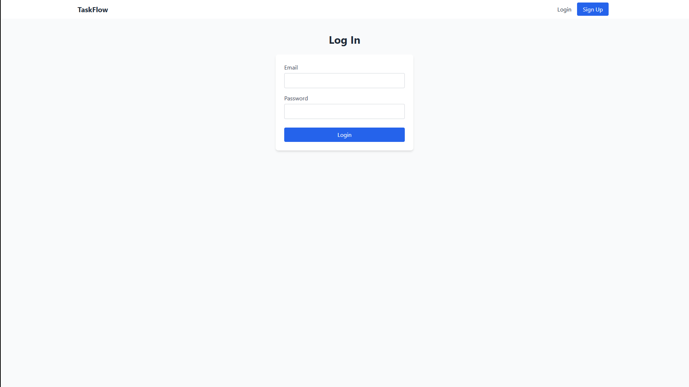

<div align="center">
  <h1>TaskFlow</h1>
  <p>
    <strong>A full-stack, Kanban-style project management board inspired by Trello and Asana.</strong>
  </p>
  <p>
    Built with the PERN stack (PostgreSQL, Express, React, Node.js) and featuring real-time, drag-and-drop task management.
  </p>
  <p>
    
    
    
    
    
  </p>
</div>


---

## 🚀 Introduction

**TaskFlow** is a dynamic and intuitive web application designed to help users and teams manage their projects and workflows efficiently. Users can sign up, log in, create tasks, and move them seamlessly between columns like "To Do," "In Progress," and "Done." All changes are persisted in a database, providing a reliable single source of truth for your project's status.

This project demonstrates a complete understanding of full-stack development, from client-side interactions and state management to server-side logic, API design, and database management.

---

## ✨ Key Features

* **🔐 Secure User Authentication**: JWT-based authentication for user registration and login.
* **Kanban Board**: A classic, clear visualization of your project workflow.
* **🖱️ Drag & Drop Interface**: Intuitively update task status by dragging cards between columns.
* **⚙️ Full CRUD Operations**: Create, Read, Update, and Delete tasks effortlessly.
* **🗄️ Persistent Storage**: All data is securely stored in a PostgreSQL database.
* **📱 Responsive Design**: A clean, modern UI that works on both desktop and mobile devices.
* **⚡️ Optimistic UI Updates**: A snappy user experience where UI changes are shown instantly.

---

## 🛠️ Tech Stack

This project utilizes a modern and robust set of technologies to deliver a high-quality user experience.

| Category      | Technology                                                                                                                                                                                                                                                              |
| :------------ | :---------------------------------------------------------------------------------------------------------------------------------------------------------------------------------------------------------------------------------------------------------------------- |
| **Frontend** | `React` `Vite` `Tailwind CSS` `react-beautiful-dnd` `axios`                                                                                                                                                                                                             |
| **Backend** | `Node.js` `Express.js`                                                                                                                                                                                                                                                  |
| **Database** | `PostgreSQL` `Prisma ORM`                                                                                                                                                                                                                                               |
| **Auth** | `JSON Web Tokens (JWT)` `bcrypt.js`                                                                                                                                                                                                                                     |

---

## 🏁 Getting Started

To get a local copy up and running, follow these simple steps.

### Prerequisites

* **Node.js** (v18 or later)
* **npm** (v8 or later)
* **PostgreSQL**: A running instance of a PostgreSQL database.

### Installation & Setup

1.  **Clone the Repository**
    ```sh
    git clone [https://github.com/andrewkristofer/TaskFlow.git](https://github.com/andrewkristofer/TaskFlow.git)
    cd taskflow
    ```

2.  **Setup the Backend (`server`)**
    ```sh
    # Navigate to the server directory
    cd server

    # Install dependencies
    npm install

    # Create a .env file from the example
    # You must fill in your DATABASE_URL and a JWT_SECRET
    cp .env.example .env

    # Run database migrations to create tables
    npx prisma migrate dev

    # Start the backend server (runs on http://localhost:5000)
    npm run dev
    ```

3.  **Setup the Frontend (`client`)**
    *In a new terminal window:*
    ```sh
    # Navigate to the client directory
    cd client

    # Install dependencies
    npm install

    # Start the frontend development server (runs on http://localhost:5173)
    npm run dev
    ```

4.  **You're all set!**
    Open your browser and navigate to `http://localhost:5173` to see the application in action.

---


## 📸 Screenshots

<p align="center">
  
  &nbsp;
  
</p>
<p align="center"><i>(Left: Login Page, Right: Main Board View)</i></p>

## 🔮 Future Enhancements

While the core functionality is complete, here are some features that could be added in the future:

* [ ] **Multiple Boards**: Allow users to create and manage multiple project boards.
* [ ] **User Invitations**: Implement a system for inviting other users to collaborate on a board.
* [ ] **Task Details**: Add due dates, priority labels, and comments to tasks.
* [ ] **Real-Time Collaboration**: Use WebSockets (e.g., with Socket.io) to instantly sync changes across all connected clients.
* [ ] **Dark Mode**: Add a theme toggle for user comfort.

---

## 📜 License

Distributed under the MIT License. See `LICENSE` for more information.

---